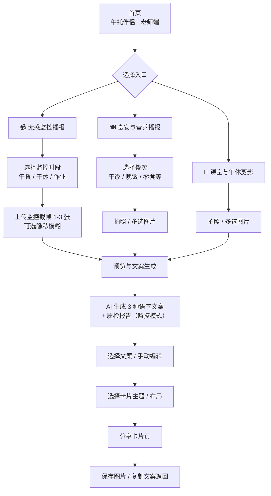

# 午托伴侣  MVP

面向午托班老师的移动端 H5 家校沟通工具。老师上传就餐或活动照片，系统调用大模型生成文案并合成分享卡片，降低日常家校同步成本。

> 安装、配置与操作说明见 [usage.md](./usage.md)

---

## Demo 演示

https://github.com/user-attachments/assets/45f0d30f-4418-4c2f-8193-fa738abccaf8

---

## 核心能力

| 模块 | 状态 | 说明 |
|------|------|------|
| **手拍播报** | ✅ 已完成 | 拍照上传 → AI 生成文案 → 合成分享卡片 |
| **无感监控播报** | ⚠️ 部分完成 | 流程与 UI 已打通；当前为上传截帧模拟，RTSP / 云端摄像头接入待实现 |

**手拍播报**：支持食安、活动多场景，餐次选择、多图上传、三种语气文案、五种卡片主题。

**无感监控播报**：按午餐 / 午休 / 作业辅导时段配置监控计划，AI 质检 + 文案生成；正式版将对接机构现有摄像头。

---

## 整体用户流程



---

## 界面预览

> 以下为移动端界面截图，宽度约 320px 模拟手机屏幕。

### 首页

入口聚合手拍播报与无感监控播报，可配置机构名称与 Logo。

<p align="center">
  
</p>

### 食安播报 · 场景选择

选择餐次后上传就餐照片，支持多图。

<p align="center">
  
</p>

### 预览与文案生成

AI 生成三种语气文案，支持编辑确认后进入卡片生成。

<p align="center">
  
</p>

### 分享卡片

一键导出精美图文卡片，可直接发送至家长群或朋友圈。

<p align="center">
  
</p>

### 无感监控播报（演示态）

监控时段选择与截帧上传流程；真实摄像头自动抓拍尚未接入。

<p align="center">
  
</p>

---

## 技术栈

Next.js 15 · React 19 · Tailwind CSS 4 · 火山方舟豆包多模态 API · html-to-image

---

## 快速启动

```bash
cd 小微AI
npm install
npm run dev
```

访问 [http://localhost:3000](http://localhost:3000)。环境变量与完整使用流程见 [usage.md](./usage.md)。

